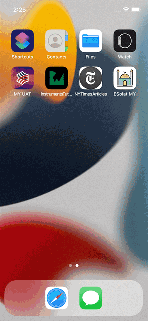

# MuslimPrayerApp

MuslimPrayerApp is muslims prayers app. Currently this App works only in West Malaysia and East Malaysia regions.
App will fetch realtime prayers timings depends on the selected zones. This application will be helpful for muslims who would like to get reminder for their selected zone prayer times and wants to see the Solat(Prayer) timings.

MuslimPrayerApp project followed MVVM-C(Model View ViewModel and Coordinator) architecture pattern.

App implemented with iOS and swift framework. Its pure iOS and Swift app.
Following third-pary dependencies used
RXSwift
RXCocoa
RxDataSources
Note:Used limited RX functionality in the app.

# Features!
  - Prayer Times(Current, Upcoming)
  - Islamic and Greogorian calendar dates
  - Previous and Next Prayers times
  - Prayer times by Select zone 
  - Prayers realtime Push notifications for prayer time
  - Mute or show push notifcations
  - Find Near mosques
  - full Azan audio

# Technical Specification!
  - XCode
  - iOS 13.0+
  - Simulator or iOS device

iOS XCTest framework is used for UnitTesting.
Basic unit test coverage has done.

iOS XCTest framework is used for UITesting
POM(Page Object Model) pattern used For UI Testing.
All screens covered with UITesting.
Good number of test coverage has done. 

### Example
Potrait                    
:-------------------------:
             

### Project Overview
 MVVM-C                                       | Unit Test                                        | UI Test
:-------------------------------------------:|:-------------------------------------------------:|:-------------------------:
 |  | 

### Unit test and UI test result

Unit Test Result                   |  UI Test Result
:---------------------------------:|:-------------------------:
| 

License
-------

    Copyright 2022 Shahul Hameed Shaik

    Licensed under the Apache License, Version 2.0 (the "License");
    you may not use this file except in compliance with the License.
    You may obtain a copy of the License at

       http://www.apache.org/licenses/LICENSE-2.0

    Unless required by applicable law or agreed to in writing, software
    distributed under the License is distributed on an "AS IS" BASIS,
    WITHOUT WARRANTIES OR CONDITIONS OF ANY KIND, either express or implied.
    See the License for the specific language governing permissions and
    limitations under the License.
